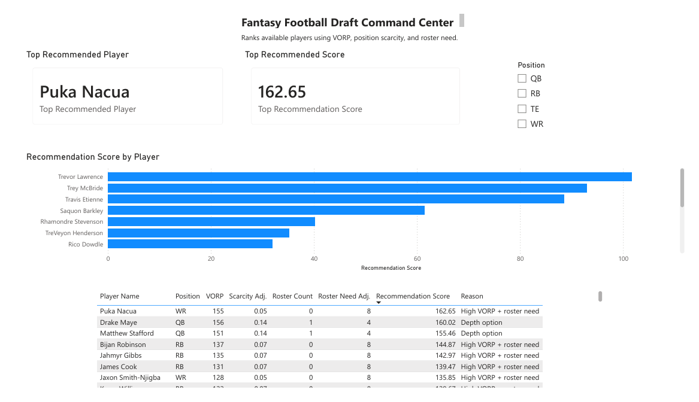

# Fantasy Football Draft Analyzer
*By Chawin Pathompornvivat*

A portfolio analytics project that builds a fantasy football draft decision engine using Python, DuckDB, SQL, and Power BI. The project ranks available players in a 12-team half-PPR draft by combining value over replacement, position scarcity, current roster need, and a plain-English recommendation reason.

**Table of Contents**
* [Getting Started](#getting-started)
* [Fantasy Football Draft Analyzer at a Glance](#fantasy-football-draft-analyzer-at-a-glance)
* [Analytics Objective](#analytics-objective)
* [Data Pipeline and Technologies Used](#data-pipeline-and-technologies-used)
* [Data Model Overview](#data-model-overview)
* [SQL Analytics Workflow](#sql-analytics-workflow)
* [Dashboard Overview](#dashboard-overview)
* [Key Metrics](#key-metrics)
* [Project Structure](#project-structure)
* [Conclusion and Next Steps](#conclusion-and-next-steps)

## Getting Started

To run this project locally, clone the repository:

```bash
git clone https://github.com/pchawin40/FantasyFootballDraftAnalyzer.git
cd FantasyFootballDraftAnalyzer
```

### Create and Activate a Virtual Environment

Create the virtual environment one time:

```bash
python3 -m venv .venv
```

Activate it each time you work on the project:

```bash
source .venv/bin/activate
```

When the virtual environment is active, the terminal should show something similar to:

```bash
(.venv) ~/personal/FantasyFootballDraftAnalyzer$
```

Install the required packages:

```bash
pip install -r requirements.txt
```

### Run the Full Analytics Pipeline

The main project pipeline can be run with one command:

```bash
python src/run_pipeline.py
```

This command:

1. Loads sample player projection data
2. Loads sample drafted-player data
3. Creates or refreshes the DuckDB database
4. Builds the recommendation SQL view
5. Exports the final dashboard-ready CSV to `outputs/draft_recommendations.csv`

### Run Tests

```bash
pytest
```

Expected result:

```text
2 passed
```

## Fantasy Football Draft Analyzer at a Glance

Fantasy managers have to make draft decisions under uncertainty. A player may have strong projected points, but the best pick also depends on roster construction, remaining player pool, position scarcity, and replacement-level value.

The Fantasy Football Draft Analyzer simulates that decision process by ranking available players based on:

* Value over replacement player, or VORP
* Position scarcity
* Current roster need
* Final recommendation score
* Plain-English recommendation reason

The final output is designed for a draft-room dashboard where a user can quickly answer:

* Who is the best available player at my current pick?
* Which positions are becoming scarce?
* Does this player fit my current roster?
* Why is this player being recommended?

## Analytics Objective

### Research Question

Given my draft position, current roster, league scoring settings, and the players already selected, which available player provides the greatest incremental value for my team?

### Project Objective

Build an end-to-end analytics workflow that transforms player and draft data into an explainable draft recommendation system. The project demonstrates skills relevant to BI analyst, revenue analyst, pricing analyst, and RevOps analyst roles, including data modeling, SQL analytics, pipeline design, metric development, and dashboard reporting.

## Data Pipeline and Technologies Used

This project uses a lightweight local analytics stack:

* **Python**: Loads sample data, refreshes the pipeline, and exports dashboard-ready output
* **Pandas**: Handles CSV-based data transformations
* **DuckDB**: Serves as the local analytical database
* **SQL**: Builds schemas, views, player rankings, and recommendation logic
* **Power BI Desktop**: Creates the Draft Command Center dashboard
* **Pytest**: Validates scoring and value calculations
* **GitHub**: Stores project code, documentation, and dashboard artifacts

### Pipeline Flow

```text
sample_players.csv
        |
        v
Python load script
        |
        v
DuckDB tables
        |
        v
SQL recommendation view
        |
        v
draft_recommendations.csv
        |
        v
Power BI dashboard
```

## Data Model Overview

The current database uses a small star-schema-inspired model:

### `dim_player`

Stores player-level attributes.

```text
player_id
player_name
position
nfl_team
```

### `fact_player_projection`

Stores player projection and value metrics.

```text
projection_id
player_id
season
projected_points
replacement_points
vorp
```

### `fact_draft_pick`

Stores drafted players by pick and team.

```text
draft_pick_id
round_number
pick_number
team_number
player_id
```

This structure keeps player attributes, projections, and draft activity separate so the recommendation logic can be updated without rebuilding the entire project.

## SQL Analytics Workflow

The SQL workflow builds from simple player rankings into a recommendation model.

### 1. Player Value Ranking

`sql/03_player_value.sql` ranks players by projected value over replacement.

### 2. Available Player Filtering

`sql/04_available_players.sql` excludes players who already appear in the draft pick table.

### 3. Position Scarcity Score

`sql/05_recommendation_score.sql` calculates the number of available players by position and adds a scarcity adjustment.

### 4. Roster Need Adjustment

`sql/06_roster_need_score.sql` adjusts recommendations based on the current team's roster construction.

### 5. Recommendation Reason

`sql/07_recommendation_reason.sql` creates a plain-English reason for each recommendation, such as:

```text
High VORP + scarce position + roster need
High VORP + roster need
Scarce position
Depth option
```

### 6. Recommendation View

`sql/08_create_recommendation_view.sql` creates the final reusable recommendation view used by the export script and Power BI dashboard.

## Dashboard Overview

The Power BI dashboard, named **Draft Command Center**, presents the recommendation output in a recruiter-friendly BI format.



The dashboard includes:

* Top recommended player card
* Top recommendation score card
* Position slicer
* Recommendation score by player bar chart
* Detail table with player, position, VORP, recommendation score, and recommendation reason

The dashboard is powered by:

```text
outputs/draft_recommendations.csv
```

## Key Metrics

### Value Over Replacement Player, or VORP

VORP estimates how much more valuable a player is compared with a replacement-level option at the same position.

```text
VORP = projected_points - replacement_points
```

### Scarcity Adjustment

The scarcity adjustment gives a small boost to positions with fewer available players remaining.

```text
scarcity_adjustment = 10.0 / available_player_count
```

### Roster Need Adjustment

The roster need adjustment gives a boost to positions the current team has not filled yet.

```text
0 players at position = +8
1 player at position  = +4
2+ players at position = +0
```

### Recommendation Score

The final recommendation score combines the major decision factors.

```text
recommendation_score = VORP + scarcity_adjustment + roster_need_adjustment
```

## Project Structure

```text
.
├── README.md
├── config/
│   └── league_settings.yaml
├── dashboard/
├── data/
│   ├── sample_draft_picks.csv
│   └── sample_players.csv
├── images/
│   └── draft_command_center.png
├── notebooks/
│   └── exploration.ipynb
├── outputs/
│   └── draft_recommendations.csv
├── requirements.txt
├── sql/
│   ├── 01_schema.sql
│   ├── 02_cleaning.sql
│   ├── 03_player_value.sql
│   ├── 04_available_players.sql
│   ├── 05_recommendation_score.sql
│   ├── 06_roster_need_score.sql
│   ├── 07_recommendation_reason.sql
│   └── 08_create_recommendation_view.sql
├── src/
│   ├── export_recommendations.py
│   ├── extract.py
│   ├── load.py
│   ├── projections.py
│   ├── run_pipeline.py
│   └── transform.py
└── tests/
    └── test_scoring.py
```

## Common Commands

Activate the virtual environment:

```bash
source .venv/bin/activate
```

Run the full pipeline:

```bash
python src/run_pipeline.py
```

Run tests:

```bash
pytest
```

Open the DuckDB database:

```bash
duckdb fantasy_football.duckdb
```

Run a SQL file manually inside DuckDB:

```sql
.read sql/08_create_recommendation_view.sql
SELECT * FROM recommendation_view;
```

Exit DuckDB:

```sql
.exit
```

Save changes to GitHub:

```bash
git status
git add .
git commit -m "Describe what changed"
git push
```

## Conclusion and Next Steps

This project started as a fantasy football draft helper and developed into a small analytics decision engine. It demonstrates how raw player and draft data can be converted into a structured data model, analytical metrics, recommendation logic, and a BI dashboard.

The current version focuses on sample data and explainable SQL-based logic. The next improvements are:

* Expand the sample player pool from 10 players to 40-50 players
* Add historical NFL or fantasy data from a public data source
* Add more realistic replacement-level calculations by position
* Add bye week and risk indicators
* Add draft round and pick context
* Add model validation or backtesting against historical results
* Improve the Power BI dashboard layout and formatting
* Explore live draft data through Sleeper API or Yahoo Fantasy API later

The long-term goal is to turn this into a more realistic fantasy draft decision-support system while keeping the project relevant to analytics roles through clear data modeling, reproducible SQL logic, and business-style dashboard reporting.
